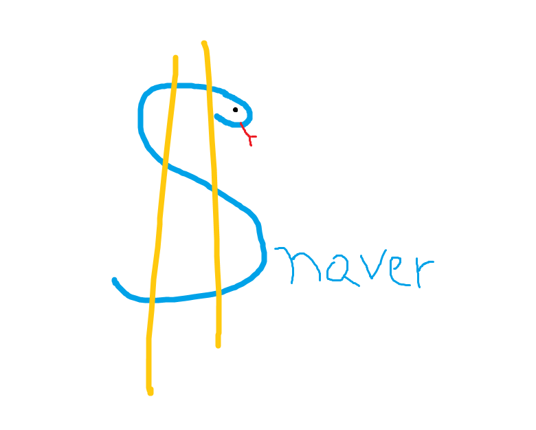

# Snaver

## Half snake, half saver, all money



## Local development environment setup

1. Create a virtual environment and run `pip install -r requirements.txt`.
2. Create a local database if you plan to use postgres.
3. In `/projects` folder create a `local_settings.py` file based on
   `local_settings.example.py`.
    * Take the database info from the step above.
    * You can use below code to generate the SECRET_KEY:
       ```python
       from django.core.management.utils import get_random_secret_key  
    
       get_random_secret_key()
       ```

### External Links

* [Jira](https://jira.is-academy.pl/secure/RapidBoard.jspa?rapidView=423&projectKey=JPYDZR2SN)


